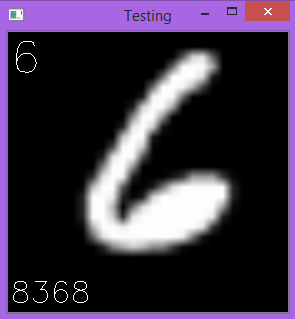

# MNIST-DeepNeuralNets
Handwritten Digit Recognition With MNIST Database - Deep Neural Network With Python 3.8

<h2> MNIST Database</h2>
<p>This database includes 60,000 training examples and 10,000 test samples with labels. Each instance is a 28 by 28 pixels grayscale image. Download the ".gz" files from the <a href="http://yann.lecun.com/exdb/mnist/" target="_blank">MNIST</a> directory. For ".gz" files you need to download are:</p>
<ul>
  <li>Training Examples: "train-images-idx3-ubyte.gz"</li>
  <li>Training Labels: "train-labels-idx1-ubyte.gz"</li>
  <li>Testing Samples: "t10k-images-idx3-ubyte.gz"</li>
  <li>Testing Labels: "t10k-labels-idx1-ubyte.gz"</li>
</ul>

<h2> Python Libraries </h2>
<p>We tried to implemet Neural Network functions and not to use libraries functions such as TensorFlow in this project. Because TensorFlow would make it simle without fully understading the mathematical level. We used hte following libraries:</p>
<ul>
  <li>numpy as np: for matrix computations</li>
  <li>gzip: to open database files</li>
  <li>cv2: I used OpenCV to show pictures and labels and verify that right lable is used for each sample</li>
  <li>time: to measure processing times</li>
</ul>
<p>
To install a module you can execute the following code line in Spyder or Jupyter Notebook: 
</P>

```
!pip install opencv-python
!pip install gzip
```
<p>Or install it via anaconda command prompt:</p>

```
conda install opencv-python
```
<h2>Reading ".gz" Database Files</h2>
<p>I wrote these lines of code to read training examples and labels database files:</p>

```
import gzip
trainingData = 'train-images-idx3-ubyte.gz'
trainingLabels = 'train-labels-idx1-ubyte.gz'
trD = gzip.open(trainingData,'r')
trL = gzip.open(trainingLabels,'r')
trD.read(16)
trL.read(8)
# the code to process data here
trD.close()
trL.close()
```
<p> Similar code is written and used for test data.<br>
  The pointer goes to the first image and lable once we read 16 elements of training data and 8 elements of training labels (same approach applies for testing). Using OpenCV to visualize images and compare them with labels helped to get feedback for it<br>
</p>
<p>
  Since each image (training example) is made of 28*28 pixels, I wrote the following code to extract instances:
</p>

```
length=28*28
instance = np.frombuffer(trD.read(length),'uint8').reshape(length,1)
```
<p>Now we can visualize each instance or use it for training</p>

<h2>How To Use The Python Code</h2>
<p>
  <ol>
    <li>Make an object of <b><em>NeuralNets</em></b> class as I did in the main function.</li>
    <li>Train the object by calling the <b><i>train()</i></b> method.</li>
    <li>Test trained parameters and get accuracy by calling the <b><i>test()</b></i> method</li>
  </ol>
</p>
<h2>Feedforward and Backpropagation</h2>
<p>
  Once you run the <b><i>train()</i></b> method, it will initialize the neural network with <b><i>initNet()</b></i> method and could show images with their labels by calling the <b><i>show()</b></i> method. 
</p>
<p>Here is a sample of the show() method that shows a testing sample, its label at the top left and its index at bottom left.<br>

</p>
<p>
  There are two mehtods I wrote for feedforward and backpropagation and they are called in each iteration if training for all 60000 instances. For testing although, only feedforward is used to test the test data. 
</p>
<h2>Manipulation</h2>
You can change size and number of hiddenlayers and the learning rate alpha. In my experience, using more layers makes the processing time of eash iteration longer but gradient descent would converge in fewer iterations. One other change that could reduce mathematical complexity and avoid stucking at steps with low sigmoid derivetives is to write ReLU or Leaky ReLU instead of


